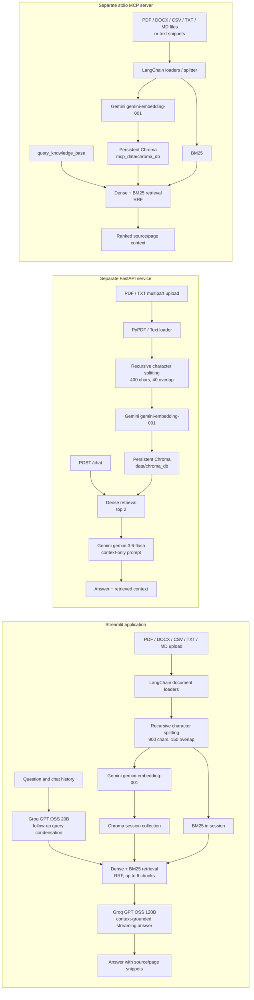

# Enterprise RAG Assistant

A local-first document assistant with three interfaces over related retrieval workflows: a Streamlit knowledge-chat app, a FastAPI upload/chat service, and a stdio Model Context Protocol (MCP) server. Documents are parsed and split into overlapping text chunks, embedded with Google's Gemini embedding model, and indexed in Chroma. Depending on the interface, retrieval is dense-only or combines dense semantic search with sparse BM25 using reciprocal rank fusion (RRF).

The Streamlit app is the primary UI and Docker entry point. Its knowledge base is scoped to the active Streamlit session. The FastAPI service and MCP server are separate programs with different indexing and persistence behavior; neither is started by the provided Compose configuration.

## Architecture



## Capabilities and Technology

| Area                  | Implementation                                                                                                                                                                                                                                                                      |
| --------------------- | ----------------------------------------------------------------------------------------------------------------------------------------------------------------------------------------------------------------------------------------------------------------------------------- |
| UI                    | Streamlit chat UI with multi-turn history, streamed answers, active-document list, CSV preview, source snippets, chat export, and document removal.                                                                                                                                 |
| Ingestion             | LangChain loaders for PDF, DOCX, CSV, TXT, and MD in the primary Streamlit/MCP flows. The FastAPI flow accepts PDF and TXT only.                                                                                                                                                    |
| Chunking              | `RecursiveCharacterTextSplitter`; fixed-size character chunks with overlap (not semantic chunking). Streamlit/MCP use 900/150; FastAPI uses 400/40.                                                                                                                                 |
| Embeddings            | `GoogleGenerativeAIEmbeddings`, model `models/gemini-embedding-001`.                                                                                                                                                                                                                |
| Vector database       | Chroma via LangChain. Streamlit creates a session-named collection without a persistence directory; FastAPI persists under `data/chroma_db`; MCP persists under `mcp_data/chroma_db`.                                                                                               |
| Retrieval             | Streamlit and MCP combine Chroma dense similarity results with `BM25Retriever` using an in-code RRF score, `1 / (60 + rank + 1)`. FastAPI uses Chroma dense similarity only, retrieving two chunks.                                                                                 |
| Reranking             | No reranker is invoked by the current ingestion/query paths. `flashrank` is present in the requirements but unused in these paths.                                                                                                                                                  |
| Query rewriting       | Streamlit uses Groq `openai/gpt-oss-20b` to turn follow-up questions into standalone search queries when chat history exists.                                                                                                                                                       |
| Answer generation     | Streamlit uses Groq `openai/gpt-oss-120b`; FastAPI uses Google `gemini-3.6-flash`. The MCP query tool returns retrieved context and does not generate an answer.                                                                                                                    |
| Citations             | Streamlit displays retrieved source name and page metadata with chunk text. FastAPI returns retrieved chunk text as `retrieved_context`; MCP formats source and page labels into its returned context. These are retrieved-source references, not independently verified citations. |
| API / agent interface | FastAPI routes for upload and chat; FastMCP stdio tools for file/snippet indexing, knowledge-base queries, and document listing.                                                                                                                                                    |

There is no implemented metadata-filtered retrieval, semantic chunking, API authentication, or FastAPI health route in the current code. The Docker health check targets Streamlit's built-in `/_stcore/health` endpoint.

## Requirements

- Python 3.11 (the Docker image uses `python:3.11-slim`). No Node.js runtime is used or required.
- `pip` and a supported OS. The Docker image also installs `build-essential` and `curl`.
- A Gemini API key for embedding calls. The primary Streamlit app additionally requires a Groq API key for query rewriting and answer generation.
- Network access to the configured Google Gemini and Groq APIs. Chroma itself runs locally; no remote vector database is configured.
- Docker Engine and the Docker Compose plugin only for the container option.

## Configuration

The application reads these environment variable names. Put real values in a local `.env` file (or Streamlit secrets); never commit credentials.

| Variable         | Used by                                                         | Required for                                                    |
| ---------------- | --------------------------------------------------------------- | --------------------------------------------------------------- |
| `GEMINI_API_KEY` | `streamlit_app.py`, `app/rag.py`, `mcp_server.py`               | Gemini embeddings; also FastAPI Gemini answer generation.       |
| `GOOGLE_API_KEY` | Same paths as above, as fallback when `GEMINI_API_KEY` is unset | Alternative name for the Google/Gemini credential.              |
| `GROQ_API_KEY`   | `streamlit_app.py`                                              | Streamlit follow-up query condensation and response generation. |

The Streamlit app also checks Streamlit Secrets for `GEMINI_API_KEY` and `GROQ_API_KEY`. No `.env.example`, `pyproject.toml`, `package.json`, or application settings file is present in the repository. Docker Compose loads `.env` into the Streamlit container.

Example `.env` shape (replace placeholders locally):

```dotenv
GEMINI_API_KEY=your_gemini_api_key
GROQ_API_KEY=your_groq_api_key
```

`GOOGLE_API_KEY` may be used instead of `GEMINI_API_KEY` for Gemini integrations. The Streamlit workflow still needs `GROQ_API_KEY`.

## Local Setup and Run

Run commands from the repository root. The supported application dependencies are listed in `requirements.txt`.

### Streamlit app (primary UI)

```powershell
py -3.11 -m venv .venv
.\.venv\Scripts\Activate.ps1
python -m pip install --upgrade pip
python -m pip install -r requirements.txt
```

Create `.env` with the required keys above, then run:

```powershell
streamlit run streamlit_app.py
```

Open the local URL printed by Streamlit (normally `http://localhost:8501`). On macOS/Linux, create and activate the environment with `python3.11 -m venv .venv` and `source .venv/bin/activate`.

### FastAPI service (separate, optional)

The FastAPI module is `app.main:app`, but `fastapi`, `uvicorn`, and `python-multipart` are not included in the checked-in `requirements.txt`. Install these service-specific packages in the same virtual environment before starting it:

```powershell
python -m pip install fastapi uvicorn python-multipart
uvicorn app.main:app --host 127.0.0.1 --port 8000 --reload
```

This service reads the Gemini key and stores uploaded source files in `data/docs/`; its Chroma collection persists in `data/chroma_db/`. It does not start automatically with the Streamlit app or Docker Compose. `app/frontend.py` and `ui.py` are Streamlit frontends targeting this service, but the Docker image runs `streamlit_app.py` instead.

### MCP server (stdio)

With the requirements installed and `GEMINI_API_KEY` (or `GOOGLE_API_KEY`) configured, start the stdio MCP server from the repository root:

```powershell
python mcp_server.py
```

Configure the MCP host to launch that command with this repository as its working directory. The server exposes tools `index_file`, `index_text_snippet`, `query_knowledge_base`, and `list_indexed_documents`, plus resource `docs://schema`. It indexes documents from `mcp_data/documents/` and `data/docs/`, and stores its Chroma data in `mcp_data/chroma_db/`.

## Docker

The provided image launches only the primary Streamlit app on port 8501. From the repository root, ensure `.env` exists with the required keys and run:

```powershell
docker compose up --build
```

Open `http://localhost:8501`. Stop it with `Ctrl+C`, or run `docker compose down` in another terminal. Compose mounts `./mcp_data` at `/app/mcp_data`; this preserves MCP data if the MCP server is run in the container, but the Compose command itself does not launch MCP. The Streamlit app's Chroma collection is session-scoped and not configured for disk persistence. The image health check checks Streamlit at `/_stcore/health`.

To build and launch without Compose:

```powershell
docker build -t enterprise-rag-assistant .
docker run --rm -p 8501:8501 --env-file .env -v "${PWD}/mcp_data:/app/mcp_data" enterprise-rag-assistant
```

## API Reference

The following routes belong to the optional FastAPI service. Start it separately as described above. It has no authentication or dedicated health-check route; do not expose it to an untrusted network without adding appropriate controls.

### `POST /upload`

Accepts `multipart/form-data` with one `file` field. The filename extension must be `.pdf` or `.txt`. On success, returns the indexed filename, number of chunks, and status.

```bash
curl -X POST http://127.0.0.1:8000/upload \
  -F 'file=@./data/docs/example.pdf'
```

### `POST /chat`

Accepts JSON containing a non-empty-by-convention `query` string. The response contains the generated answer and the retrieved chunk text in `retrieved_context`.

```bash
curl -X POST http://127.0.0.1:8000/chat \
  -H 'Content-Type: application/json' \
  -d '{"query":"What are the main points in the indexed document?"}'
```

Example response shape:

```json
{
  "answer": "Response grounded in the retrieved context.",
  "retrieved_context": ["Text from a retrieved chunk"]
}
```

Unsupported upload extensions return HTTP 400; ingestion and query exceptions are surfaced as HTTP 500 responses. The FastAPI app does not define `/health`, `/docs` manually, or a document-list route. FastAPI's interactive docs are available at `/docs` when the service is running.

## Repository Layout

```text
.
|-- app/
|   |-- main.py             # FastAPI upload and chat routes
|   |-- rag.py              # FastAPI ingestion, persistent Chroma, and Gemini RAG chain
|   `-- frontend.py         # Streamlit UI that calls the FastAPI service
|-- data/
|   |-- docs/               # FastAPI upload destination and MCP input directory
|   `-- chroma_db/          # FastAPI persistent Chroma index
|-- mcp_data/
|   |-- documents/          # MCP-managed source documents
|   `-- chroma_db/          # MCP persistent Chroma index
|-- opt/                    # Bundled FlashRank TinyBERT model assets (not used in active retrieval)
|-- .devcontainer/          # VS Code development-container configuration
|-- Dockerfile              # Python 3.11 Streamlit image
|-- docker-compose.yml      # Streamlit service on host port 8501
|-- mcp_server.py           # Stdio MCP tools and resource
|-- requirements.txt        # Python dependencies
|-- streamlit_app.py        # Primary session-scoped hybrid RAG UI
`-- ui.py                   # Alternate Streamlit UI for FastAPI upload/chat
```

Generated Chroma files and local document contents are data, not source code. The repository's `.gitignore` excludes `.env`, `data/`, and `mcp_data/`; continue to keep credentials and sensitive documents out of version control.
